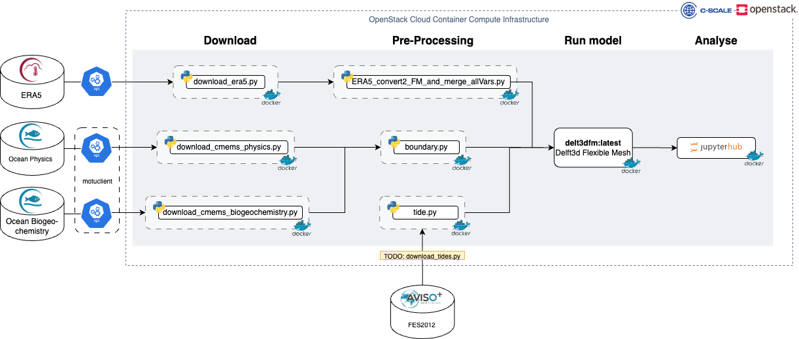

# C-SCALE Workflow Solution: Coastal hydrodynamic and water quality modelling using Delft3D FM

C-SCALE workflow solutions are intended to give users a template and reusable components to start building monitoring, modelling and forecasting applications

With the **coastal hydrodynamic and water quality modelling workflow solution** a user can easily produce hydrodynamic and water quality hindcasts or forecasts for the coastal ocean for a Delft3D FM model schematisation.

The workflow solution has the following functionality

1. Download the necessary input data for the user's [Delft3D Flexible Mesh](https://www.deltares.nl/en/software/delft3d-flexible-mesh-suite/) model setup. Input data include Copernicus' [Global Ocean Physics Reanalysis](https://resources.marine.copernicus.eu/product-download/GLOBAL_REANALYSIS_PHY_001_030) and [Global ocean biogeochemistry hindcast](https://resources.marine.copernicus.eu/product-download/GLOBAL_REANALYSIS_BIO_001_029), [ERA5](https://cds.climate.copernicus.eu/cdsapp#!/dataset/reanalysis-era5-single-levels?tab=form) and [FES2012](https://www.aviso.altimetry.fr/es/data/products/auxiliary-products/global-tide-fes/description-fes2012.html). Note, functionality to download FES2012 still needs to be developed ([issue #39](https://github.com/c-scale-community/use-case-hisea/issues/39)).
2. Prepare the data for ingestion into the user's Delft 3D Flexible Mesh [hydrodynamic](https://www.deltares.nl/en/software/module/d-flow-flexible-mesh/) and [water quality model](https://www.deltares.nl/en/software/module/d-water-quality/). This entails the preparation of forcings, initial conditions, and boundary condiditons.
3. Produce hydrodynamic and water quality hindcasts or forcasts based on the user's Delft3D Flexible Mesh hydrodynamic and water quality model setups.
4. Analyse the simulation outputs in an interactive Jupyter Notebook.

The workflow is executed using [Snakemake](https://snakemake.readthedocs.io/en/stable/index.html), a workflow management system for creating and executing reproducible and scalable data analyses. The workflow solution can be deployed on any provider part of the [C-SCALE data and compute federation](https://c-scale.eu/) offering cloud container compute.

The workflow components and flow is summarised in the below schematic:

## Prerequisites
1. Github account. Sign up [here](https://github.com/signup).
2. DockerHub account and access to https://hub.docker.com/repository/docker/deltares/delft3dfm (contact software.support@deltares.nl to arrange access)
3. CMEMS account, which can be obtained by registering at <https://resources.marine.copernicus.eu/registration-form>.
4. CDS API key. Follow instructions at <https://cds.climate.copernicus.eu/api-how-to#install-the-cds-api-key> to generate the key.
5. [Docker](https://www.docker.com/) needs to be installed on your computing environment.
6. [Snakemake](https://snakemake.readthedocs.io/en/stable/index.html) needs to be installed on your computing environment.

# Instructions

## Building the Docker containers
Instructions on how to build and run the Docker conterainers for each workflow component can be found in the README.md files of corresponding folders of this repo:

1. [download](https://github.com/c-scale-community/use-case-hisea/tree/main/scripts/download)
2. [preprocessing](https://github.com/c-scale-community/use-case-hisea/tree/main/scripts/preprocessing)
3. [fm_model](https://github.com/c-scale-community/use-case-hisea/tree/main/fm_model)
4. [notebooks](https://github.com/c-scale-community/use-case-hisea/tree/main/notebooks)

## Install Snakemake
To install Snakemake do:

1. `conda install -n base -c conda-forge mamba` 
2. `conda install -c conda-forge -c bioconda snakemake`

## Run the workflow for the example fm_model included in this repo
1. In your CLI, `cd` to `use-case-hisea/.`
2. Open `use-case-hisea/workflow/config.yml` in your preferred text editor and specify \
    a. `dependencies` \
    b. `data folder locations` \
    c. `delft3dfm folders and files` \
    d. `area of interest` (this should cover the area of your delft3dfm model schematisation) \
    e. `run mode` 
3. Execute the workflow from the `use-case-hisea/` directory by doing: `snakemake --cores 4 all`

## Additional instructions
* [Set up your computing environment](https://github.com/c-scale-community/use-case-hisea/blob/main/README-setup_compute.md)
* [Run the Docker containers individually for the fm_model example included in this repo](https://github.com/c-scale-community/use-case-hisea/blob/main/README_run_fm_model_example.md)
